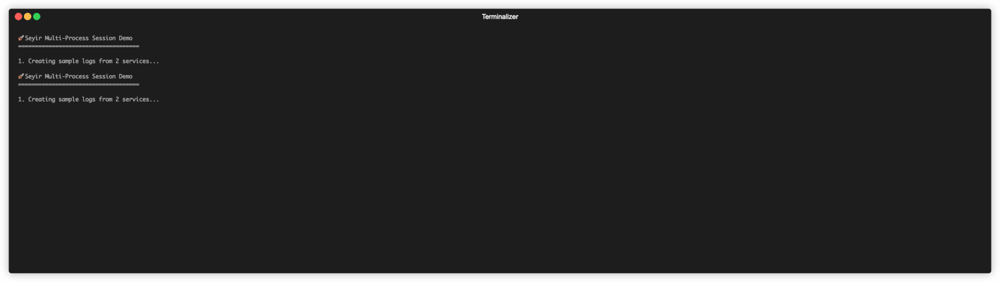

# Seyir

> **Seyir** is a lightweight, self-hosted log collector and viewer — stream your local or container logs through a simple pipe and search them instantly.

Built for developers who want to **pipe**, **store**, and **search** logs locally — no cloud, no agents, no external dependencies.


---

## ✨ Features

* **Pipe anything** → View and search logs streamed via `stdin`
* **Session management** → Group multiple processes into named sessions
* **Interactive TUI** → Real-time log viewing with vim-style navigation
* **Auto-discovery** → Detects Docker containers with `seyir.enable=true`
* **DuckDB storage** → Fast search on compressed Parquet files
* **Web UI** → Real-time viewing at `http://localhost:5555`
* **Structured parsing** → JSON, key-value, and timestamps
* **Compaction** → Automatic file merging for performance
* **Retention** → Configurable cleanup by time or size
* **Self-contained** → No database, no dependencies

---

## 🚀 Session Management

Monitor multiple processes in a unified interface with Seyir's session management.



*Demo: Managing logs from 2 services in a single session with real-time TUI*

Try it yourself:

```bash
# Run the demo
./demo-simple.sh

# Then open TUI to view the logs
./seyir session start demo
```

### Real-World Example: E-commerce Microservices

```bash
# Attach your services (session will be created automatically)
docker-compose logs -f gateway | seyir session attach ecommerce-app gateway &
docker-compose logs -f product-svc | seyir session attach ecommerce-app product-svc &
docker-compose logs -f postgres | seyir session attach ecommerce-app postgres &
docker-compose logs -f redis | seyir session attach ecommerce-app redis &

# Monitor everything in real-time TUI
seyir session start ecommerce-app
```

**Benefits:**
- 🔍 **Trace correlation** - Follow requests across all services
- ⚡ **Real-time monitoring** - Live log streaming from all processes  
- 🎯 **Smart filtering** - Quickly isolate errors, warnings, or specific traces
- 🚀 **Developer-friendly** - Vim-style navigation and search

### TUI Features

- **Real-time log streaming** from all attached processes
- **Vim-style navigation** (j/k, gg/G, Ctrl+U/D, PgUp/PgDn)
- **Quick filtering** by log level (1=All, 2=Errors, 3=Warnings, 4=Traces)
- **Search functionality** (press `/` to search)
- **Message details** (press Enter to view full message)
- **Trace ID grouping** - easily follow requests across services

### Session Commands

```bash
# Session management
seyir session list                       # List active sessions  
seyir session start <name>               # Open TUI for session
seyir session stop <name>                # Stop session
seyir session cleanup                    # Remove inactive sessions

# Process attachment (creates session automatically)
seyir session attach <session> <process> # Attach logs via pipe
```

---

## ⚡ Quick Start

### 1. Install

**Quick install (Linux/macOS):**

```bash
# Latest version
curl -fsSL https://semihy.github.io/seyir/scripts/install.sh | bash

# Verify installation
seyir version
```

**Docker:**

```bash
docker run -d \
  --platform linux/amd64 \
  -v /var/run/docker.sock:/var/run/docker.sock \
  -v seyir-data:/app/data \
  -p 5555:5555 \
  ghcr.io/semihy/seyir:latest
```

**From source:**

```bash
git clone https://github.com/SemihY/seyir.git
cd seyir
make install-user   # Local (~/.local/bin)
make install        # System-wide (/usr/local/bin)
```

---

### 2. Run Service

```bash
# Start collector + Web UI
seyir service

# Only Web UI (read-only mode)
seyir web --port 8080
```

Then visit → [http://localhost:5555](http://localhost:5555)

---

### 3. Pipe Logs

```bash
# From Docker
docker logs mycontainer | seyir

# From Kubernetes
kubectl logs -f deployment/api | seyir

# From file
tail -f app.log | seyir
```

---

## 🔍 Search Examples

```bash
seyir search "error"
seyir query filter --levels=ERROR,WARN --limit=100
seyir query filter --trace-ids=abc123
seyir query filter --start='2025-01-01' --end='2025-01-02'
seyir query distinct --column=source
```

---

## ⚙️ Configuration

`~/.seyir/config/config.json`:

```json
{
  "retention": { "enabled": true, "retention_days": 30 },
  "ultra_light": { "enabled": true, "buffer_size": 10000 },
  "debug": { "enable_query_debug": false }
}
```

Reload after editing:

```bash
seyir service restart
```


## 🐳 Coolify

```yaml
version: '3.8'
services:
  seyir:
    image: 'ghcr.io/semihy/seyir:latest'
    platform: linux/amd64
    ports:
      - '5555:5555'
    volumes:
      - '/var/run/docker.sock:/var/run/docker.sock'
      - 'seyir-data:/app/data'
    environment:
      PORT: '${PORT:-5555}'
    restart: unless-stopped
volumes:
  seyir-data:
    driver: local
```

---

## 🤝 Contributing

Contributions and feedback are welcome!
Open an issue or PR at [github.com/SemihY/seyir](https://github.com/semihy/seyir)

---

## 🧭 Version

```bash
seyir --version
# Version: v1.0.0
# Commit: a1b2c3d4
# Built: 2025-10-25_14:30:15
# Go: go1.24.7
# Platform: linux/amd64
```

---

## 📜 License

MIT License © 2025 Semih Yıldız

---